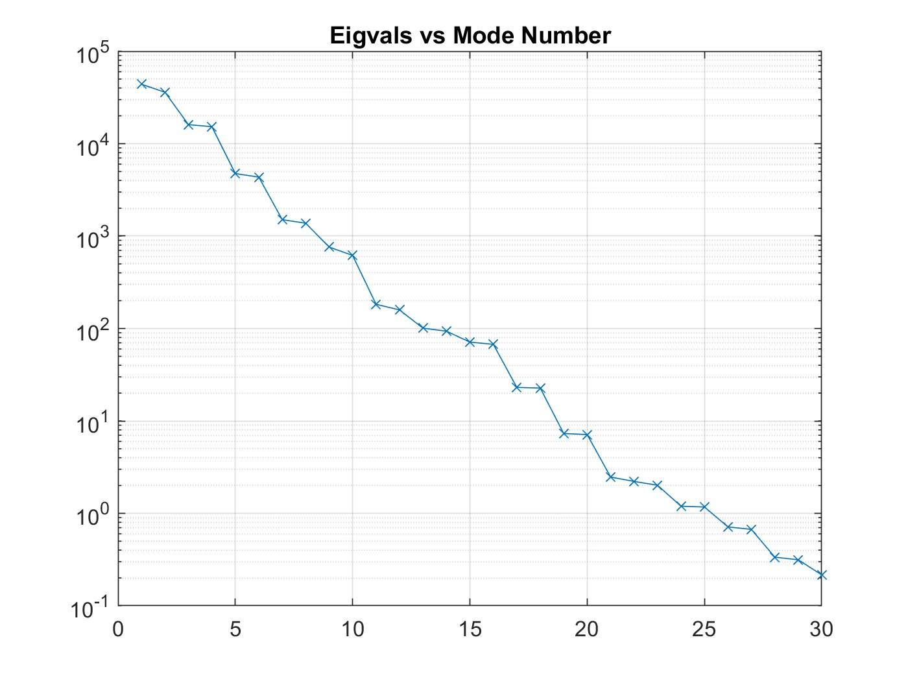
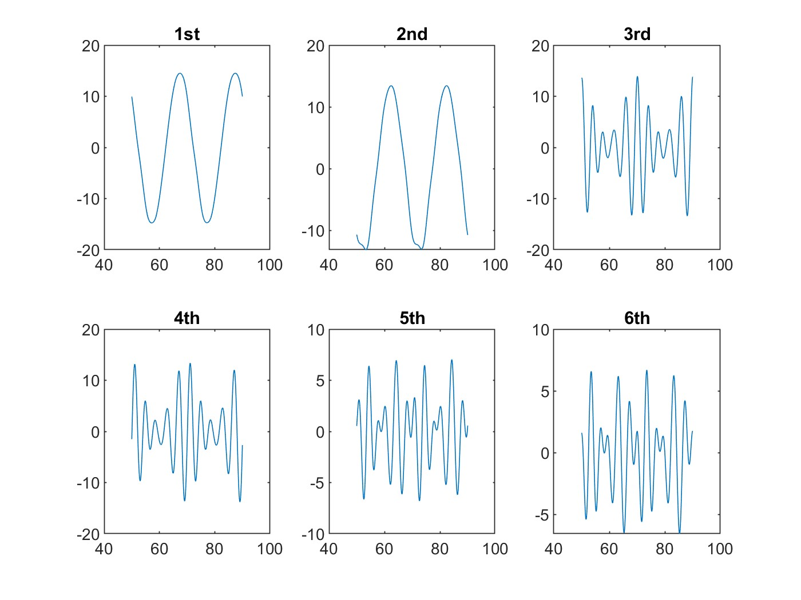
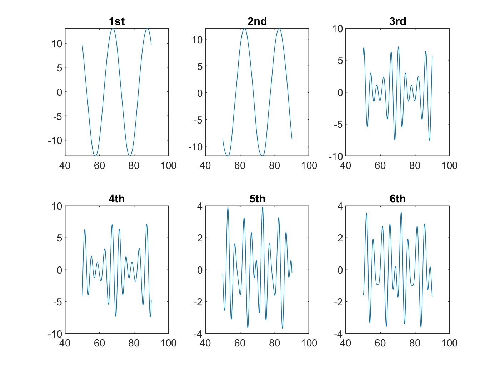
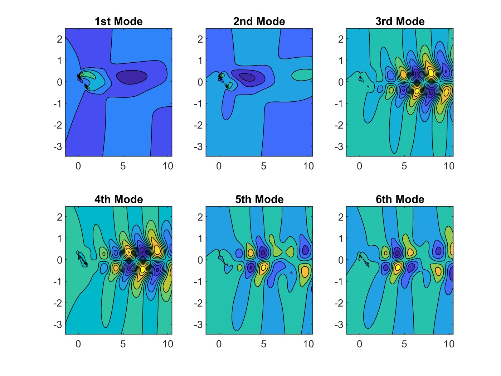
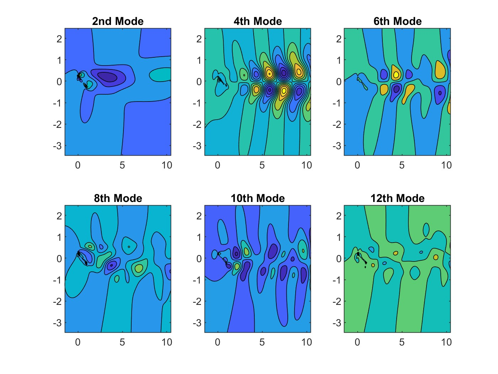

<h2> Single Value Decomposition: Introduction </h2>

 SVD is a method that allows the decomposition of any matrix into two matrices made of orthonormal eigenbases, and a matrix of corresponding eigenvalues. Basically, any matrix A can be rewritten in the form $U\Sigma V^*$, and $U$ and $V$ are special because they’re unitary basis vectors, and their inverses are their transposed matrices; this makes calculations a lot easier. The values in the $\Sigma$ matrix correspond to how much a particular basis participates in the data; it kind of ranks the eigenvectors in terms of “importance”; it's a matrix of the eigenvalues square-rooted. The eigenvectors with larger eigenvalues will appear toward the top of the matrices. A similar matrix of the original matrix $A$ can be reconstructed with a lower resolution by just using a specified number of “important” modes; the eigenvalues tend to drop off sharply after a certain point, so you only end up having to include, let’s say, 100 rows instead of 1,000,000, because the 999,900 other rows are rather insignificant.

<h2> How to decompose using SVD </h2>
<ol>
<li> Find the mean and subtract it from all values in the $A$ matrix. Otherwise, the mean will appear as a large mode (?).
<li> Reshape the mean-corrected matrix (assuming its a 3D matrix of gridsize mxn by t number of snapshots) such that each column is a snapshot (ie. reshape it so the new matrix has mxn rows and t columns).
<li> Plot the $\Sigma^2$ against their "rank" (row number) (?). Pick an appropriate cutoff point for the reconstruction (rank $r$ of SVD).
<li> Select the first $r$ rows of $U$, first $r$ elements of $\Sigma$, and first $r$ rows of $V$ (because you multiply its transpose). Multiple $U\Sigma V^*$ and reshape to retain the original time "snapshots" (reshape into a 3D mxnxt).
<li> Add back the mean.
<li> Plot individual timesteps.
</ol>

<h2> Analysis of Dataset </h2>
<h3> Eigenvalue vs Mode Index </h3>

 After setting up and computing the SVD using the MATLAB functon, we are given the $\Sigma$. Below, $\Sigma^2$ is plotted against mode number. The values plateau after modes 150 and 220, for Ux and Uy respectively. Cutting off the rank much earlier will still reconstruct a decently accurate representation of matrix $A$. 

<h3> Temporal Amplitudes </h3>

 The SVD function also gives us $V$, which, when multiplied with the $S$ matrix, yields the temporal amplitudes of the dataset. The temporl amplitudes describe, roughly, the distribution of energy (how active(?) the system is) across time(?). Because the data has been mean corrected, the average of these sinusoidal waves should be zero, as it is measuring the energy fluctuations. 

<em>First Six Temporal Amplitudes of a Stacked Matrix</em>

<em>First Six Temporal Amplitudes of Ux</em>

<h3> Spatial Modes </h3>

 The remaining $U$ matrix shows the energy distributions (?) of the dataset spatially. The oscillatory patterns are pretty notable, and they indicate the fluctuations of the actual wake.

<em>First Six Spatial Modes</em>

<em>First Six Spatial Modes of Ux</em>
