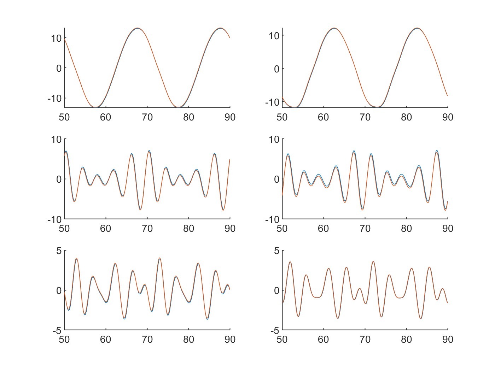

<h2> Sparse Identification of Non-Linear Dynamics: Introduction </h2>

 Sparse Identification of Non-Linear Dynamics, or SINDy, is an algorithm that fits data to a non-linear polynomial(?).

[!Note]
the details are lost on me. the order and number of variables of the polynomial is pre-set, and all the "terms" are combinations of variables. for example, a second order fitted SINDy polynomial with three variables would look something like: $c_1x_1 + c_2x_2 + c_3x_3 + c_12x_1x_2 + c_13x_1x_3 + c_23x_2x_3$, where the $c_ij$'s are determined by SINDy. The algorithm Brunton uses to fit the data to the polynomial is "sequentially thresholded least squares" (STLS); the "threshold" prevents overfitting by eliminating any extremely small coefficients.

<h2> How to use SINDy </h2>

 For this example, the temporal amplitudes from the POD analysis will be pushed through SINDy, and the SINDy approximation for the curves will be compared to the POD plots.
<ol>
<li> Find or import the temporal amplitudes from POD. 
<li> Find the approximate (finite?) derivative using $\Delta x / \Delta t = (x_{k+1} -x_k) / \Delta t$
<li> Set n (number of variables), the order of the polynomial, and lambda, the sparsification knob (which determined how aggressively SINDy fits the data). 
<li> $\Theta$ is the list of combinations of variables. $\Xi$ (Xi) is a matrix of the coefficients. $\Theta\Xi$ gives us a derivative(?) we can integrate using trapezoids to get the original function.
<li> Because we took discrete time derivative, we lose a value. To get around this, just drop the last POD temporal amplitude and time field value. Plot the POD amplitudes(blue) and the SINDy approximation (red).
</ol>

<em>Comparison of POD and SINDy Approximation for First Six Temporal Amplitudes</em>
