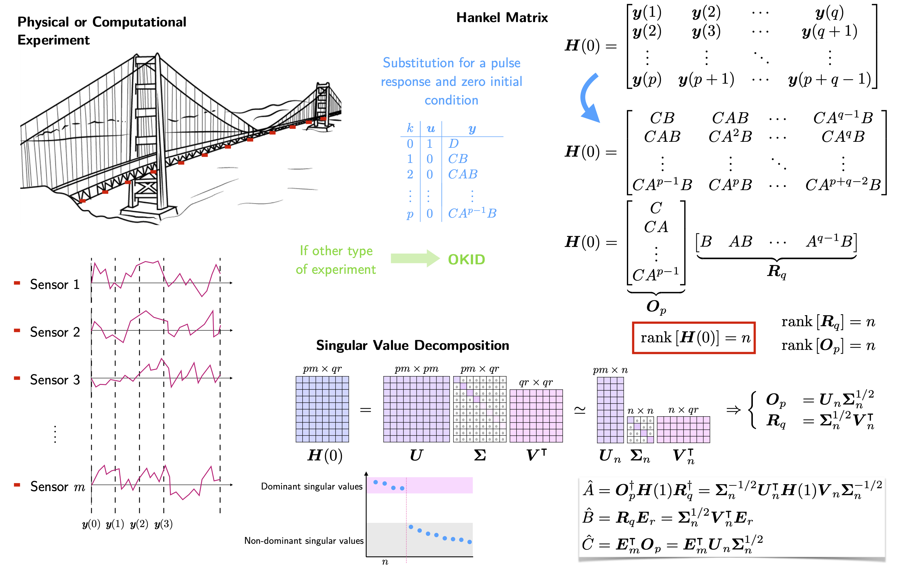
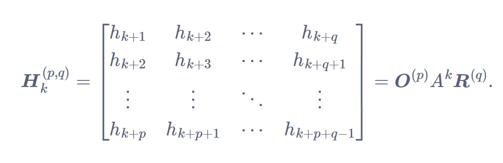

<h2> Eigensystem Realization Algorithm: Introduction </h2>
<h3> Summary</h3>

 Source: http://www.systemidtechnologies.com/approach/chapter5/ 

<h4> Hankel Matrix </h4>

<h3> Method </h3>
<ol>
    <li> State space of form $y = Ax + Bu$
    <li> Hankel Matrix, starting with $y_0$ in the first entry.
    <li> Shifted Hankel Matrix, $H_2$, where entries are shifted by one.
    <li> Trim Hankel Matrices to get rid of null entries, or to a value $k$.
    <li> Perform SVD on unshifted Hankel matrix.
    <li> Reduce SVD variables to rank $r$, to output $\Sigma_r$, $U_r$, and $V_r$.
    <li> Find $A_r$, $B_r$, $C_r$, and $D_r$ of state space form.
        <ul id="ind">
            <li> $A_r = \Sigma^{-\frac {1}{2}} U_r' H_2 V_r \Sigma^{-\frac {1}{2}}$
            <li> $B_r = \Sigma^{-\frac {1}{2}} V_r' E_r$
            <li> $C_r = E_m' U_r \Sigma^{-\frac {1}{2}}$
            <li> $D_r = 0$
        </ul>   
    <li> Reconstruct state space with $A_r$, $B_r$, $C_r$, and $D_r$
</ol>

<h3> Example using transfer function </h3>

<head>

</head>