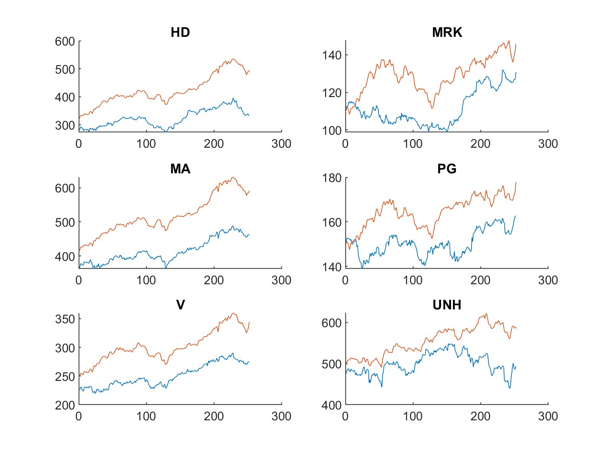
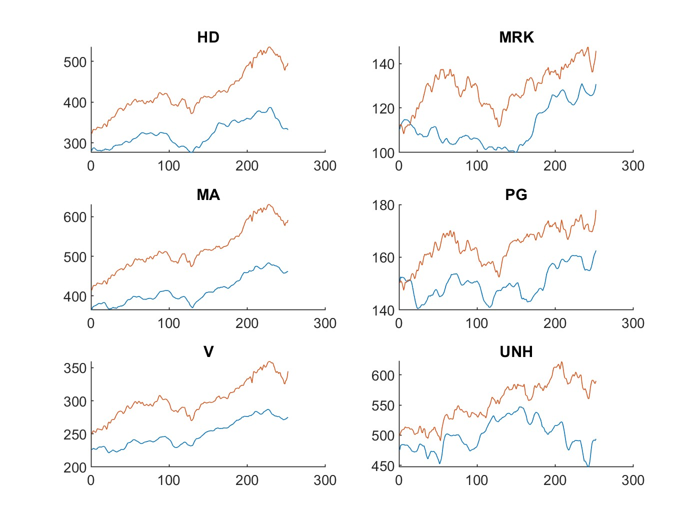
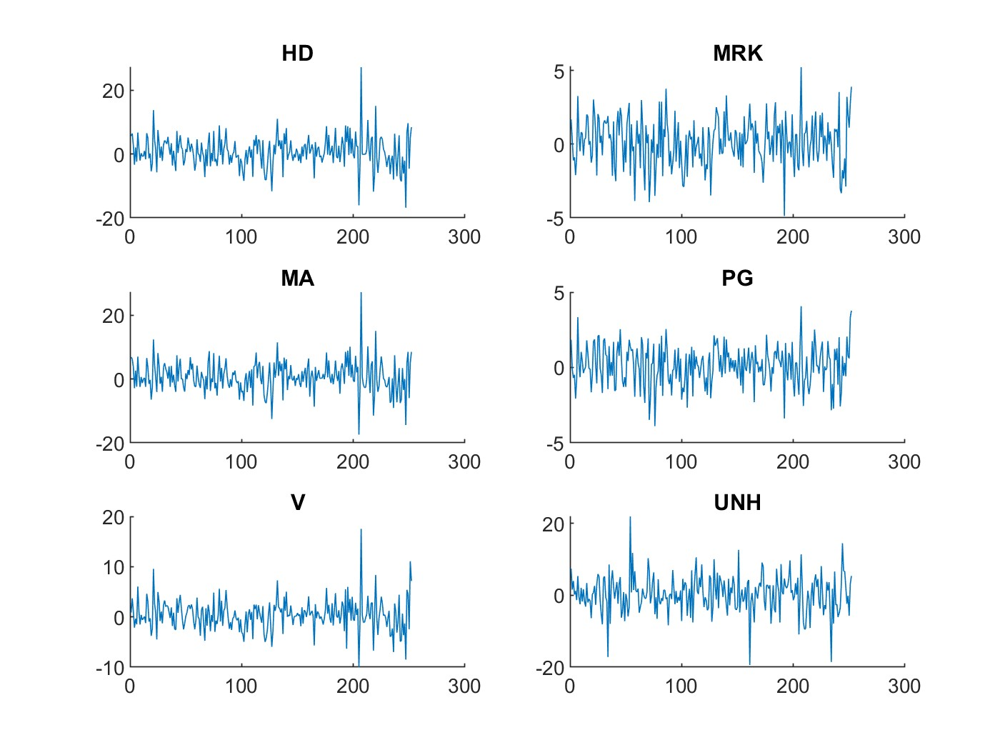
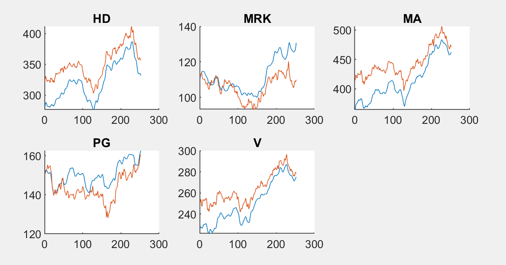

<h1> Final Project </h1>
<h2> Objective: </h2>

 To use SINDy to model stock prices. 

<h2> Method </h2>
<ol> Collect closing stock prices for the top twenty (or so) companies in the S&P 500 from the past year (or so).
<ol> Start with using the first five companies for the model, and set number of variables to three (price, time, company) and polynomial order to 1 (first order approximation).
<ol> Find the finite differences with a time step of 1 (day). Find the average of the smoothed data.
<ol> Apply SINDy algorithm. 
<ol> Integrate SINDy derivative signal for each company and add back the respective mean. Plot.

<h2> Issues
<il> Smoothing: Because stock proces can heavily differ from day to day, the data was extremely jerky and didn't resemble a smooth curve; since I thought SINDy was robust with noise, I thought it could overcome the somewhat discontinous, discrete nature of the data. However, Prof. Luchtenburg advised that smoothing the data would improve the model. The data was smoothed using a moving average filter of length 5 (taking the average of the data point and two points on either side).

  

      
      
  

  

      
      
  

<il> Second order approximation

<h2> Results </h2>
<h3> Using the first 5 companies </h3>

 

