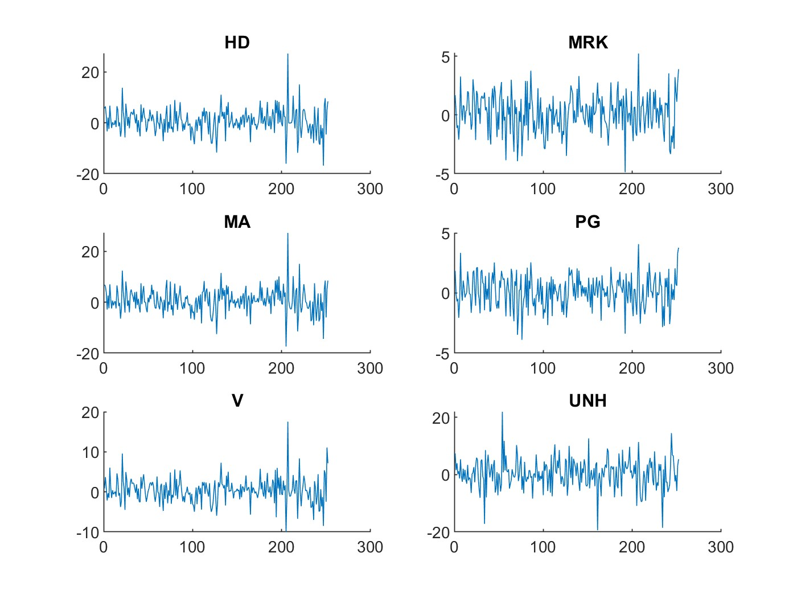
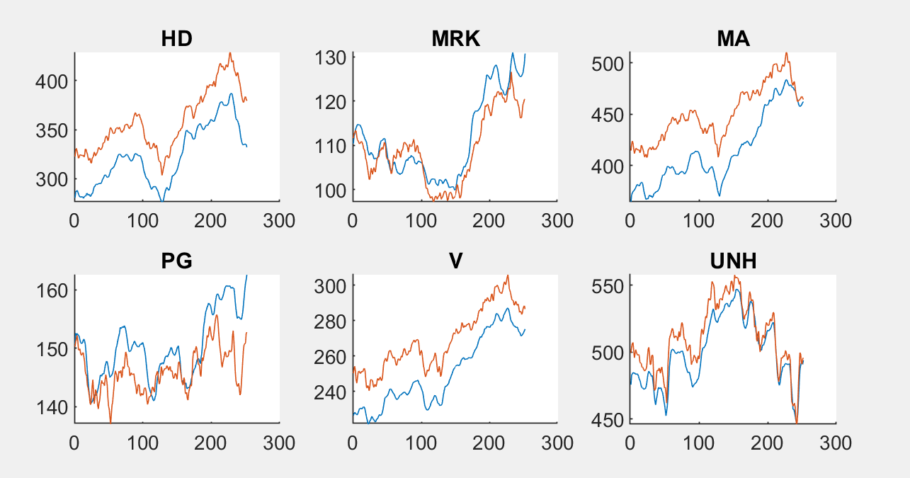
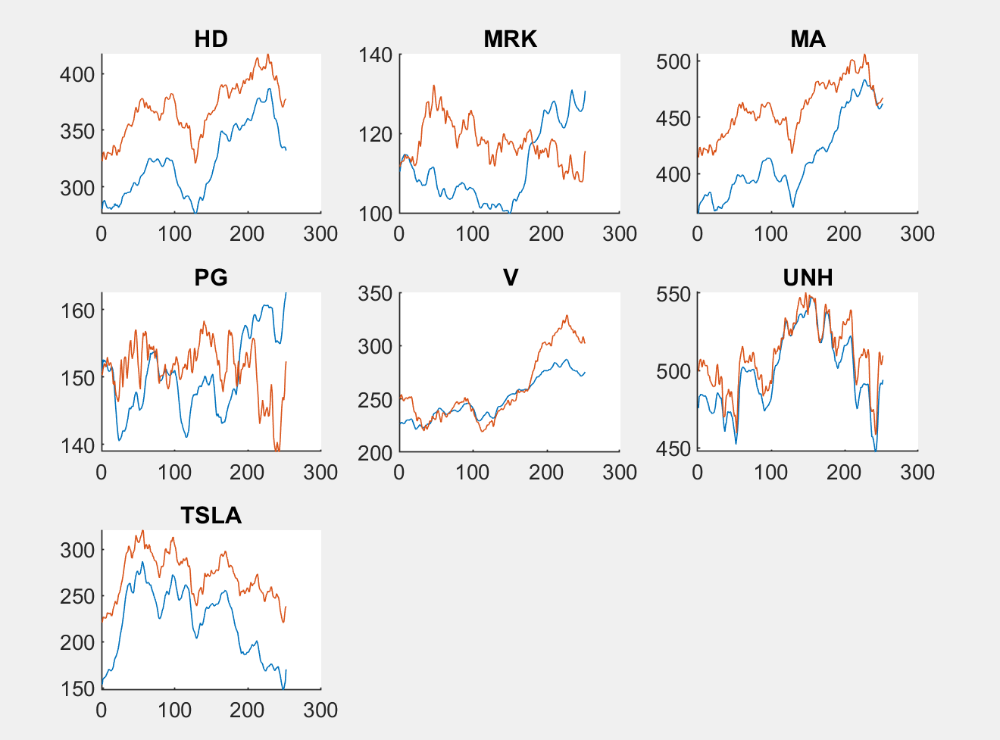
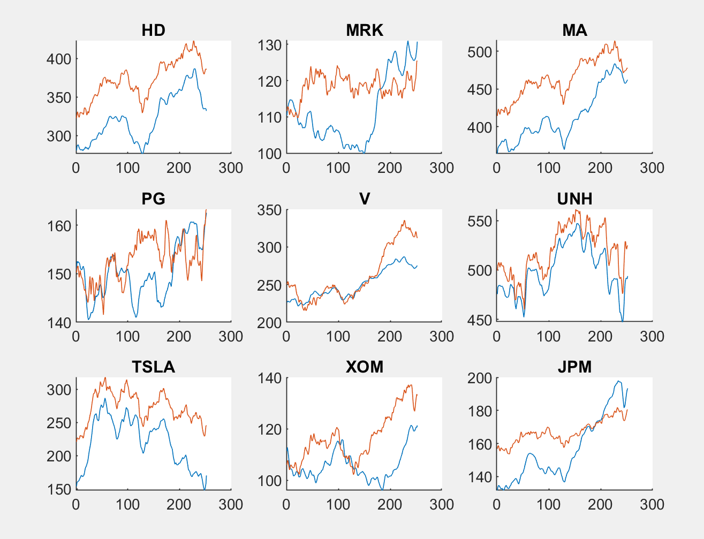

<html>
<head>

</head>

<h1> Final Project </h1>
<h2> Objective: </h2>

 To use SINDy to model stock prices. 

<h2> Method </h2>
<ol>
    <li> Collect closing stock prices for the top twenty (or so) companies in the S&P 500 from the past year (or so).</li>
    <li> Start with using the first five companies for the model, and set number of variables to three (price, time, company) and polynomial order to 1 (first order approximation). </li>
    <li> Find the finite differences with a time step of 1 (day). Find the average of the smoothed data.</l>
    <li> Apply SINDy algorithm. </li>
    <li> Integrate SINDy derivative signal for each company and add back the respective mean. Plot.</li>
</ol>

<h2> Issues </h2>
<li> <b>Smoothing:</b> Because stock proces can heavily differ from day to day, the data was extremely jerky and didn't resemble a smooth curve; since I thought SINDy was robust with noise, I thought it could overcome the somewhat discontinous, discrete nature of the data. However, Prof. Luchtenburg advised that smoothing the data would improve the model. The data was smoothed using a moving average filter of length 5 (taking the average of the data point and two points on either side).

    <h3> No Smoothing </h3>
    

          
          
    

    <h3> No Smoothing </h3>
    

          
          
    

 
<li> Second order approximation: There appears to be some instability in the system that blows up when SINDy attempts to fit a second order approximation. First order is the best fit.

 

<h2> Results </h2>
<h3> Using the first 5 companies </h3>

 The use of the first five companies (namely Home Depot, Merck & Co., Mastercard, Proctor & Gamble, and Visa) to approximate each other provides a decent fit; although PG has some significant deviation, the other models appear to be exhibiting trends very well. 

<h3> Using the first 6 companies </h3>

 Now includes UnitedHealth Group. Very close fitting with UNH. Slight improvement to MRK and PG. V, HD, and MA worsened slightly. All graphs satisfactorily fit trends. 

<h3> Using the first 7 companies </h3>

 Now includes Tesla. PG and MRK significantly decrease in quality. V, MA, HD, UNH, and TSLA fit trends. 

<h3> Using the first 9 companies </h3>

 Now includes Exxon Mobil and JP Morgan. All graphs are deteriorating closeness, but UNH and TSLA keep trends pretty consistently. Not a great fit for XOM and JPM. 

<h2> Future Work </h2>
<ol>
    <li> Quantify error and how well the approximation follows the general trend of the data.
        <ul id="ind">
        <li> Quantify offset for each point (day) and plot finite difference curve. If slope of curve is close to zero, meaning the offset of the data is generally constant, it suffciently "follows the trend". Evaluating how well SINDy follows trends, instead of focusing on just the offset from the actual stock price, is more important for trading purpses.
        </ul>
    <li> Figure out which combination of stocks and smoothing yields the best "trend-following" approxmation. 
        <ul id="ind">
        <li> Currently, which company stocks are included in the model is determined by the order I put them in in the Excel file. Running SINDy on companies of similar industries, ie. running META, GOOG, AMZN, and TSLA together might yield good results since the markets are highly correlated.
        </ul> 
    <li> Figure out a way to analyze which companies are "highly correlated" without prior knowledge of industry. 
        <ul id="ind">
        <li> Maybe look at sigma values outputted by the SVD to see which sets of data are more "important", or which stocks have the biggest impact on the stock of interest.
        </ul>
    <li> Try different models to assess approximation.
        <ul id="ind">
        <li> ERA: using ERA is quite difficult as the stock data can be said to have "multiple signals", and isn't an easy system to characterize and put into the ERA. "Block matrices" are necessary...
        </ul>
    <li> Attempt to predict stock price and trend.
        <ul id="ind">
            <li> Allow the data to read only to day 200 (instead of 256, for example). Integrate the derivative signal SINDy gave to further timesteps, and see if the algorithm can accurately predict.
        </ul>

</html>